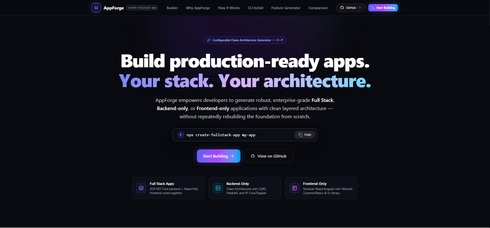
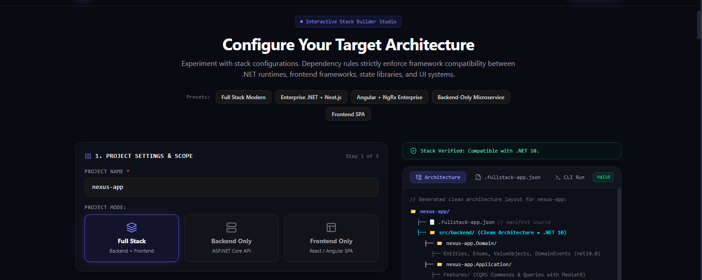

# generate-fullstack-app

<p align="center">
  
</p>

A flexible, production-grade project, feature, and application module generator for **ASP.NET Core Clean Architecture** backends and modern frontends (**React with Next.js or Vite**, or **Angular**).

Supports:
- **Full Stack** projects (`Backend/` + `Frontend/`)
- **Backend Only** projects (Clean Architecture at project root)
- **Frontend Only** projects (Modern SPA / SSR at project root)
- **Recommended Defaults** for instant zero-friction scaffolding
- **Custom Architecture decisions** for advanced developers
- **V4 Application Modules** (Auth, Users, Permissions, Audit, Notifications, Localization, Rich Text, Dashboard)
- **Feature Generator** with rich type models, relationships, and automatic UI/API generation

Current version: **4.0.0**

---

## Requirements

- **Node.js** ≥ 20
- **.NET SDK** ≥ 9.0 (for ASP.NET Core backends)
- **Database Engine** (SQL Server, PostgreSQL, or SQLite)
- Optional: `dotnet ef` tools (`dotnet tool install -g dotnet-ef`)

---

## CLI Commands

| Command | Purpose |
| :--- | :--- |
| `generate-fullstack-app [ProjectName]` | Interactive CLI wizard to scaffold Full Stack, Backend Only, or Frontend Only apps |
| `create-fullstack-feature [FeatureName]` | Generate end-to-end CRUD features (Domain, Application, API, Frontend) |
| `create-fullstack-module [ModuleName]` | Opt into production infrastructure modules (Auth, Users, Permissions, etc.) |

---

## Getting Started

### Run with `npx` (No installation needed)

```bash
npx generate-fullstack-app MyApp
```

### Install globally

```bash
npm install -g generate-fullstack-app

generate-fullstack-app MyApp
```

---

## Project Creation Modes

Configure the stack visually, then generate with the CLI. The interactive builder enforces compatible choices across .NET, frontend frameworks, state libraries, and UI systems:

<p align="center">
  
</p>

When running `generate-fullstack-app`, the CLI asks:

> **What do you want to create?**
> 1. Full Stack (Backend + Frontend)
> 2. Backend Only (.NET Web API)
> 3. Frontend Only (React / Next.js / Vite / Angular)

The generator only prompts for options relevant to the chosen mode.

### 1. Full Stack Mode
Generates an isolated backend and frontend structure:

```text
<ProjectName>/
├── .fullstack-app.json
├── README.md
├── Backend/
│   ├── API/
│   ├── Application/
│   ├── Domain/
│   ├── Infrastructure/
│   └── <ProjectName>.slnx
└── Frontend/
    ├── package.json
    ├── src/
    └── ...
```

### 2. Backend Only Mode
Generates the Clean Architecture solution directly at the project root:

```text
<ProjectName>/
├── .fullstack-app.json
├── README.md
├── API/
├── Application/
├── Domain/
├── Infrastructure/
└── <ProjectName>.slnx
```

### 3. Frontend Only Mode
Generates the frontend application directly at the project root:

```text
<ProjectName>/
├── .fullstack-app.json
├── README.md
├── package.json
├── src/
└── ...
```

---

## Recommended Defaults vs Customization

For each mode, developers can choose:
- **Recommended Defaults (Fast)**: Pre-configured, battle-tested stack.
- **Customize Architecture**: Tailor database, ORM, state management, UI libraries, and more.

### Backend Architecture Options

| Decision | Recommended Default | Customizable Options | CLI Flag |
| :--- | :--- | :--- | :--- |
| **Architecture** | CQRS + MediatR | CQRS + MediatR, Application Services | `--architecture <cqrs-mediatr\|services>` |
| **ORM / Data Access** | Entity Framework Core | EF Core, Dapper, EF Core + Dapper | `--orm <efcore\|dapper\|efcore-dapper>` |
| **Database** | SQL Server | SQL Server, PostgreSQL, SQLite | `--database <sqlserver\|postgresql\|sqlite>` |
| **Mapping** | Manual Mapping | Manual, AutoMapper, Mapster | `--mapping <manual\|automapper\|mapster>` |
| **Authentication** | Identity + JWT | Identity + JWT, Identity Only, None | `--auth-mode <identity-jwt\|identity\|none>` |
| **Logging** | Serilog | Serilog, Built-in ILogger | `--logging <serilog\|ilogger>` |
| **Background Jobs** | None | None, Hangfire | `--background-jobs <none\|hangfire>` |
| **Real-time** | None | None, SignalR | `--realtime <none\|signalr>` |

### Frontend Architecture Options

| Decision | Recommended Default | Customizable Options | CLI Flag |
| :--- | :--- | :--- | :--- |
| **Library / Framework** | React (Next.js App Router) | React (Next.js), React (Vite), Angular | `--frontend <react\|angular>`, `--react-framework <next\|vite>` |
| **Language** | TypeScript | TypeScript, JavaScript (React only) | `--language <typescript\|javascript>` |
| **Styling** | Tailwind CSS | Tailwind CSS, Bootstrap | `--styling <tailwind\|bootstrap>` |
| **State Management** | Redux Toolkit | Redux Toolkit, Zustand (React), NgRx (Angular), None | `--state <redux\|zustand\|ngrx\|none>` |
| **HTTP Client** | Axios | Axios, Fetch API, Angular HttpClient | `--http-client <axios\|fetch>` |
| **Forms & Validation** | React Hook Form + Zod | RHF + Zod, Angular Reactive Forms, None | `--forms <react-hook-form-zod\|reactive-forms\|none>` |
| **Component System** | shadcn/ui | shadcn/ui, Material UI, Ant Design, None | `--component-system <shadcn\|mui\|antd\|none>` |

---

## Non-Interactive & Automation Flags

Scaffold projects non-interactively using CLI flags:

### Full Stack Example
```bash
generate-fullstack-app MyApp --yes \
  --mode fullstack \
  --database postgresql \
  --orm efcore \
  --frontend react \
  --react-framework next \
  --styling tailwind \
  --auth --users --permissions --dashboard
```

### Backend Only Example
```bash
generate-fullstack-app MyApi --backend-only --yes \
  --database postgresql \
  --architecture cqrs-mediatr \
  --background-jobs hangfire
```

### Frontend Only Example
```bash
generate-fullstack-app MyUi --frontend-only --yes \
  --frontend react \
  --react-framework vite \
  --styling tailwind \
  --state zustand
```

### User Preferences
Save and reuse your preferred choices across projects:
```bash
generate-fullstack-app MyApp --save-defaults
generate-fullstack-app NextApp --use-saved-preferences --yes
```

---

## Running Generated Projects

### Full Stack
```bash
# Terminal 1: Backend API
cd MyApp/Backend
dotnet restore
dotnet run --project API

# Terminal 2: Frontend App
cd MyApp/Frontend
npm install
npm run dev
```

### Backend Only
```bash
cd MyApi
dotnet restore
dotnet run --project API
```

### Frontend Only
```bash
cd MyUi
npm install
npm run dev
```

Default Dev URLs:
- **Next.js**: `http://localhost:3000`
- **Vite**: `http://localhost:5173`
- **Angular**: `http://localhost:4200`
- **ASP.NET Core API**: `http://localhost:5000` (Swagger at `/swagger`, Health check at `/health`)

---

## Manifest (`.fullstack-app.json`)

The manifest is the single source of truth for all generators, storing exact folder paths and configuration:

```json
{
  "projectName": "MyApp",
  "paths": {
    "backend": "Backend",
    "frontend": "Frontend"
  },
  "backend": {
    "enabled": true,
    "architecture": "cqrs-mediatr",
    "orm": "efcore",
    "database": "postgresql",
    "authentication": "identity-jwt"
  },
  "frontend": {
    "enabled": true,
    "library": "react",
    "framework": "next",
    "language": "typescript",
    "styling": "tailwind",
    "state": "redux"
  },
  "modules": {
    "auth": { "enabled": true, "version": "4.0.0" }
  }
}
```

---

## V4 Production Application Modules

Opt-in modules add production-grade features without coupling:

| Module | Depends on | What it generates |
| :--- | :--- | :--- |
| `auth` | — | Identity + JWT access tokens (memory only) + HttpOnly refresh cookies (SHA-256 hash & rotation) |
| `users` | auth | Admin user search, create, update, role assignments |
| `permissions` | auth | `Feature.Action` granular permissions & dynamic authorization policies |
| `audit` | — | Audit trail with automatic sensitive-field redaction |
| `notifications` | auth | In-app notification center with recipient validation |
| `localization` | — | Database-driven domain content languages (`Language`, Accept-Language header) |
| `rich-text` | — | Structured TipTap JSON documents + safe renderer |
| `dashboard` | — | Admin layout, navigation registry, and dashboard widgets |

### Module CLI Commands
```bash
# List available modules
create-fullstack-module --list

# Check enabled modules in current project
create-fullstack-module --status

# Install module (interactive or with --yes)
create-fullstack-module auth --yes
create-fullstack-module users --yes

# Create EF migration for module
create-fullstack-module auth --migration
```

---

## Feature Generator

Generate complete end-to-end CRUD features adhering to Clean Architecture and your chosen frontend stack.

### Field Types & Modifiers

| Field Kind | Syntax Example | Notes |
| :--- | :--- | :--- |
| **Scalar** | `Name:string:required:max=200`<br>`Price:decimal:required:min=0` | string, int, long, decimal, double, boolean, Guid, DateTime, DateTimeOffset |
| **Enum** | `Status:enum:name=ProductStatus:values=Draft\|Active\|Archived:required` | Strongly-typed C# enum + TypeScript union |
| **Relationship** | `Category:relationship:target=Category:type=many-to-one:required:display=Name`<br>`Tags:relationship:target=Tag:type=many-to-many:display=Name` | Creates Foreign Keys, Navigation Properties, EF configurations, and UI Select dropdowns |
| **File / Image** | `Avatar:image:required`<br>`Document:file` | Multipart file upload integration via `IFileStorageService` |
| **Rich Text** | `Content:richText:required` | TipTap structured JSON editor and renderer |

### Feature Generation Example

```bash
# 1. Create related features
create-fullstack-feature Category --yes --field "Name:string:required:max=150"
create-fullstack-feature Tag --yes --field "Name:string:required:max=100"

# 2. Create main feature with relationships
create-fullstack-feature Product --yes --surface both \
  --field "Name:string:required:max=200" \
  --field "Price:decimal:required:min=0" \
  --field "Category:relationship:target=Category:type=many-to-one:required:display=Name" \
  --field "Tags:relationship:target=Tag:type=many-to-many:display=Name" \
  --field "Status:enum:name=ProductStatus:values=Draft|Active|Archived:required" \
  --field "Image:image" \
  --field "Description:richText"
```

---

## Development & Testing

```bash
# Run unit & integration test suites
npm test

# Run syntax linter
npm run lint

# Run end-to-end smoke tests
npm run smoke
```

---

## License

MIT © [Ahmed Ibrahim](https://github.com/AhmedIbrahim-tech)
